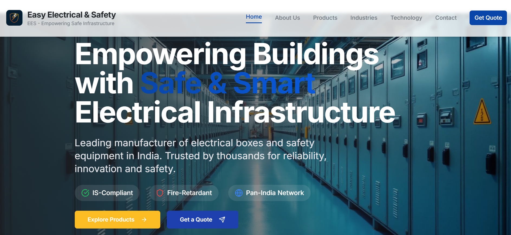

# 🌐 websit For Easy Electrical & Safety 

 


---

## 📖 Project Overview
This repository contains the complete source code for **Ranjeet**'s website.  
The site is built to be **modern, fast and mobile-responsive**, and is deployed on **Netlify** for seamless hosting and updates.

**Tech Stack:**
- **Frontend:** Vite.js, Tailwind, React.js
- **Hosting:** Netlify 

---

## 🔗 Live Website
🌍 **Live URL:** [https://www.easyelectrical.in](https://www.easyelectrical.in)

---

## 🛠️ Local Setup & Development
Follow these steps to run or modify the project locally:

```bash
# 1. Clone this repository
git clone https://github.com/arreharsh/ees-frontend.git
cd ees-frontend

# 2. Install dependencies 
npm install

# 3. Start development server
npm run dev

# 4. Build for production
npm run build
```
---
## 📩 Contact & Support
For updates, bug fixes, or new features:
- 👨‍💻 **Developer:** Harsh Prajapati
- 📧 **Email:** hey@harshstack.me
- 📞 [Contact via WhatsApp](https://wa.me/917065196288)
- 🛠 **Maintenance:** Monthly updates & support available (on request)
